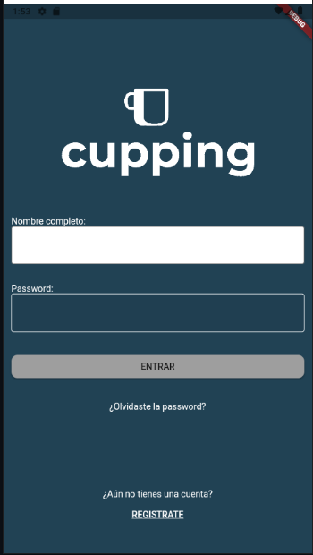
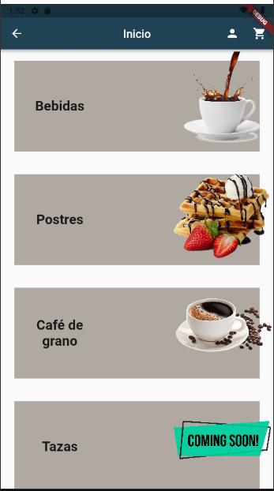
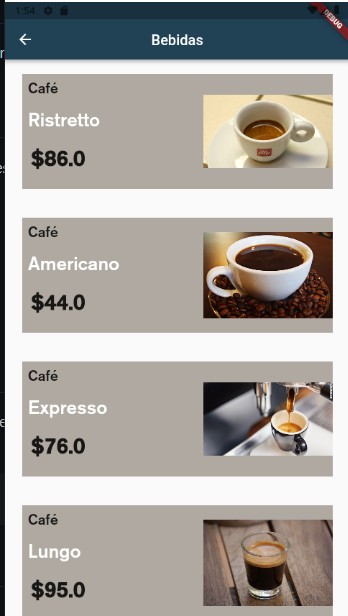
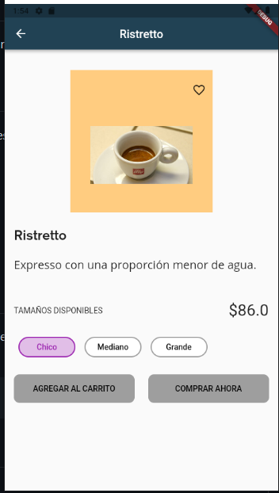
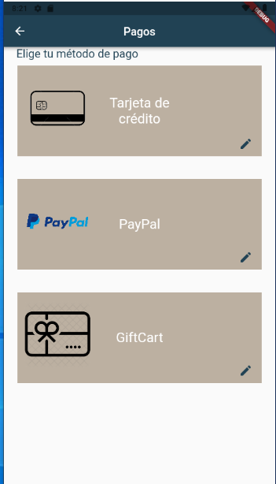
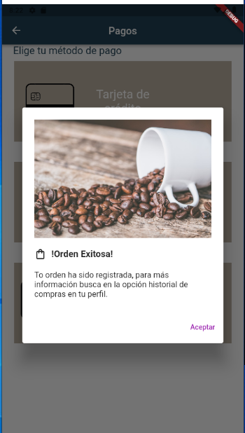
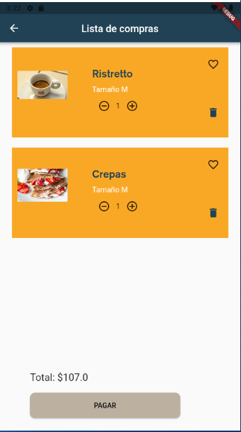

# Práctica integradora 1

El propósito de la práctica integradora es aplicar los temas vistos en clase, en el transcurso de las sesiones previas.

# Temas a evaluar

- Componentes visuales: Scaffold, Columnas, Filas, Contenedores, Botones, Texto, etc
- Diagrama: Diagrama de los componentes (básico)
- Estados: Widgets Stateful, Widgets Stateless, Handler de estados
- Navegación: Rutas, Paginas, Paso de parámetros
- Alertas: Diálogos, Snackbars
- Recursos: Assets, Fuentes, estilos, themes

# Set Up
En terminal del VS Code ejecutar el siguiente comando para descargar las dependencias del proyecto antes de empezar a trabajar.
```sh

flutter packages get
```
## App Screenshot
...







